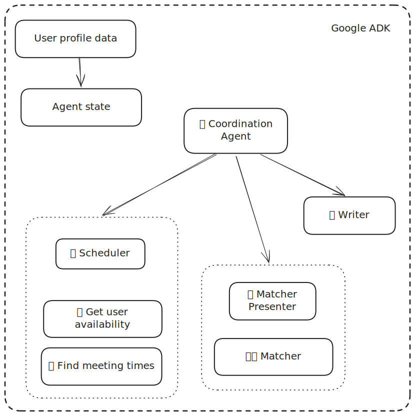

# Coordination Agent Demo

This project is a demonstration of an AI agent architecture that can perform a few practical tasks using [Google's Agent Development Kit (ADK)](https://google.github.io/adk-docs/).

This project is not meant to be deployed as is. The project is primarily a learning project, but it highlights different strategies and suggests ideas for other designs.

The main focuses for this project are:
1. Modularity: Construct a system that can be decomposed into functional blocks to be replace or reused
1. Flexibility: Build a system that can work with a variety of LLM models (does not rely on specific high-performant LLMs for expected functionality)
1. Reliability: Define an agent architecture that can produce consistent results within the specifications of the expected tasks
1. Extensibility: Indicate areas that can be extended on to improve reliability or function

## Overview

The Coordination Agent is designed to be an assistant for logistics and operations. It can group a list of given users together based on a "profile" of each of the users (data that needs to be available before-hand), find a commonly available 30-minute time block for all the involved users (provided user calendars), then prepare to send an email to the users to coordinate a virtual group conversation.

### Agent Architecture

The agent is designed using a multi-agent architecture. The system shows using AI agents as tools, delegation to sub-agents, and coordination using state. The "root agent" is a reasoning agent that should reason about the context of the conversation and requests to best effectively utilize other agents to fulfill the user's request.

## Prototype Key Details

Since this is a prototype project, some elements are simplified for demonstration purposes. It should be possible to extend or supplement the current state to bring this project to a fully-featured agent. Some key notes for this project are listed below.

### User Profiles
This project originally used a proprietary profile system. As such, the `matcher` has been configured and modified to be able to use a different profile framework. For the sake of example, MBTI is used and sample profiles were created for imaginary users. The agent state is seeded with this profile data from a JSON file.

In a production scenario, we can use an MCP server to fetch user profiles to store into the state before a session is started.

### User Availabilities
Because this is a demonstration project, user availability schedules are simulated. Random blocks of availability are generated for each requested user. We use [Google OR-Tools](https://developers.google.com/optimization) to find overlapping time slots.

In a production scenario, we can use an MCP server to fetch user calendars and construct availability schedules with the `scheduler` agent before coordinating.

### Emails
This project does not send emails. Instead, email drafts are returned to demonstrate the functionality. Additionally, the prompting could use some work to be more clear about the desired behavior.

In a production scenario, we can use an MCP server to interact with an email service. One can imagine additionally using email as a communication modality for the root agent using such an MCP server.

### LLM Selection
Throughout this project, different kinds of models were tested to evaluate the state of performance of those models. The main focus were local offline models (`llama3.x`) and small foundation models (`gpt4.1-nano`). By leveraging multi-agent systems with defined roles, one should be able to accomplish relatively complicated tasks. This project was a test to see what the thresholds of "good enough" such that the multi-agent system wouldn't break down due to unexpected behavior.
